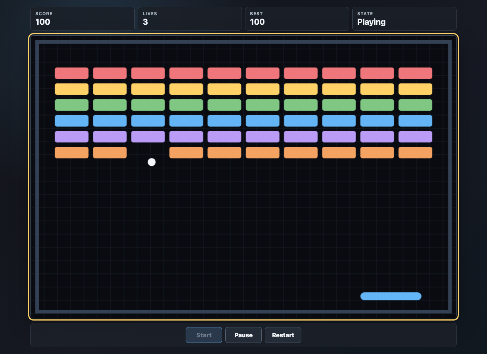

# Agentic Breakout Example

This repository is a worked example of a document-stack methodology for agentic software development, implemented by building a small JavaScript Breakout game.

The game is intentionally browser-only: static HTML, CSS, and JavaScript, with a single-user high score stored in one browser.

## Documentation Site

The public documentation site is published through GitHub Pages:

https://la3lma.github.io/agentic-breakout-example/



## Document Stack

- `docs/00-source-instructions.md`
- `docs/01-tldr.md`
- `docs/02-concept.md`
- `docs/03-prd.md`
- `docs/04-architecture.md`
- `docs/05-execution-plan.md`
- `docs/06-lab-notebook.md`

The lab notebook is part of the stack. It captures human instructions, agent notes, decisions, detours, and validation observations that do not belong in the stricter execution plan.

## Live Plan

Generate the live plan page:

```bash
make plan
```

Open or refresh the plan in the system browser using AppleScript:

```bash
make refresh-plan
```

The generated page is written to `site/plan.html`.

## Publish

Generate the full documentation site locally:

```bash
make site
```

After changes are merged to `main`, publish the generated site through GitHub Pages:

```bash
make publish
```
