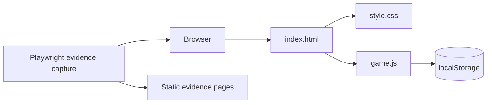

# Architecture Document

## Overview

The game is a static browser application.

## Components

- `index.html`: game shell and UI.
- `src/styles.css`: visual presentation and responsive layout.
- `src/game.js`: game state, rendering, controls, collisions, score, lives, and high-score persistence.
- `evidence/`: static evidence pages, screenshots, videos, and notes.
- `scripts/`: utility scripts for rendering the live plan and capturing evidence.
- `docs/`: document stack and lab notebook.

## Runtime Model

The game uses a `requestAnimationFrame` loop. State lives in JavaScript objects. The canvas is redrawn every frame. Input updates the paddle target or paddle velocity. High score is read from and written to `localStorage`.

## Evidence Model

Playwright starts or connects to a local static server, loads the game, interacts with it briefly, captures screenshots, records short MP4 clips, and writes a static `evidence/index.html` page that links the artifacts.

