# Execution Plan

The implementation is decomposed into simple agentic use cases. Each use case is tracked as a GitHub issue and implemented through a pull request. During planning, graph nodes link to issues. After implementation, each node is updated to link to the corresponding PR.

## Use-Case Graph

```mermaid
flowchart LR
  UC01["UC-01\nBootstrap repo\nand stack"]
  UC02["UC-02\nPlayable\nBreakout core"]
  UC03["UC-03\nSingle-browser\nhigh score"]
  UC04["UC-04\nPolish and\ninput ergonomics"]
  UC05["UC-05\nEvidence site\nand PR graph"]
  UC06["UC-06\nDocumentation site\nand Pages"]

  UC01 --> UC02
  UC02 --> UC03
  UC03 --> UC04
  UC04 --> UC05
  UC05 --> UC06

  classDef done fill:#d9f7d9,stroke:#238636,color:#0b3d16,stroke-width:2px
  classDef ready fill:#fff3bf,stroke:#b08900,color:#4b3b00,stroke-width:2px
  classDef running fill:#ffe0b2,stroke:#c26a00,color:#4a2500,stroke-width:2px
  classDef review fill:#dbeafe,stroke:#2563eb,color:#0f2f70,stroke-width:2px
  classDef blocked fill:#ffd6d6,stroke:#b42318,color:#5c1111,stroke-width:2px
  classDef deferred fill:#eadcff,stroke:#7e3fb2,color:#3a1a5f,stroke-width:2px

  class UC01,UC02,UC03,UC04,UC05 done
  class UC06 running

  click UC01 "https://github.com/la3lma/agentic-breakout-example/pull/6" "PR #6"
  click UC02 "https://github.com/la3lma/agentic-breakout-example/pull/7" "PR #7"
  click UC03 "https://github.com/la3lma/agentic-breakout-example/pull/8" "PR #8"
  click UC04 "https://github.com/la3lma/agentic-breakout-example/pull/9" "PR #9"
  click UC05 "https://github.com/la3lma/agentic-breakout-example/pull/10" "PR #10"
  click UC06 "https://github.com/la3lma/agentic-breakout-example/issues/11" "Issue #11"
```

  Done
  Ready
  Running
  Review
  Blocked
  Deferred

## Use Cases

### UC-01 Bootstrap Repository and Document Stack

- Issue: https://github.com/la3lma/agentic-breakout-example/issues/1
- PR: https://github.com/la3lma/agentic-breakout-example/pull/6
- Goal: establish repository structure, document stack, lab notebook, live plan page, and Makefile support.
- Pre-conditions: public repository and local checkout exist.
- Post-conditions: stack documents exist, plan page can be generated, and `make refresh-plan` opens or refreshes the plan tab.
- Observables: repository tree, generated `site/plan.html`, browser tab refresh.
- Status: complete.

### UC-02 Implement Playable Breakout Core

- Issue: https://github.com/la3lma/agentic-breakout-example/issues/2
- PR: https://github.com/la3lma/agentic-breakout-example/pull/7
- Goal: implement paddle, ball, bricks, collision detection, lives, score, pause/restart, win/loss states.
- Pre-conditions: document stack and scaffold exist.
- Post-conditions: game runs as a static web app and is visibly playable.
- Observables: browser run, Playwright smoke check, screenshot.
- Status: complete.

### UC-03 Add Single-Browser High Score

- Issue: https://github.com/la3lma/agentic-breakout-example/issues/3
- PR: https://github.com/la3lma/agentic-breakout-example/pull/8
- Goal: persist one best score in one browser using `localStorage`.
- Pre-conditions: playable core exists.
- Post-conditions: best score is visible and survives reloads in the same browser.
- Observables: Playwright localStorage persistence check.
- Status: complete.

### UC-04 Polish Presentation and Input Ergonomics

- Issue: https://github.com/la3lma/agentic-breakout-example/issues/4
- PR: https://github.com/la3lma/agentic-breakout-example/pull/9
- Goal: make the game comfortable to demonstrate.
- Pre-conditions: core and high score exist.
- Post-conditions: responsive layout, keyboard and pointer/touch controls, clear status UI.
- Observables: desktop and mobile screenshots, short gameplay clip.
- Status: complete.

### UC-05 Capture Evidence Site and Update Issue-to-PR Graph

- Issue: https://github.com/la3lma/agentic-breakout-example/issues/5
- PR: https://github.com/la3lma/agentic-breakout-example/pull/10
- Goal: capture evidence artifacts and update the graph links to PRs.
- Pre-conditions: polished game exists and previous PRs exist.
- Post-conditions: evidence site exists, screenshots and MP4 clips are present, lab notebook is updated, graph links to PRs.
- Observables: `evidence/index.html`, screenshots, videos, final graph.
- Status: complete.

### UC-06 Publish Documentation Site

- Issue: https://github.com/la3lma/agentic-breakout-example/issues/11
- PR: pending
- Goal: publish a polished GitHub Pages documentation site that presents the project, document stack, evidence, and playable game.
- Pre-conditions: the game, document stack, evidence captures, and PR graph exist.
- Post-conditions: the generated site contains TL;DR, concept/vision, PRD, architecture, plan, source instructions, lab notebook, browsable evidence, and a playable game page at `https://la3lma.github.io/agentic-breakout-example/`.
- Observables: generated `site/` pages, compact graph legend, GitHub Pages workflow, published Pages URL, and playable game from the documentation site.
- Status: running.
